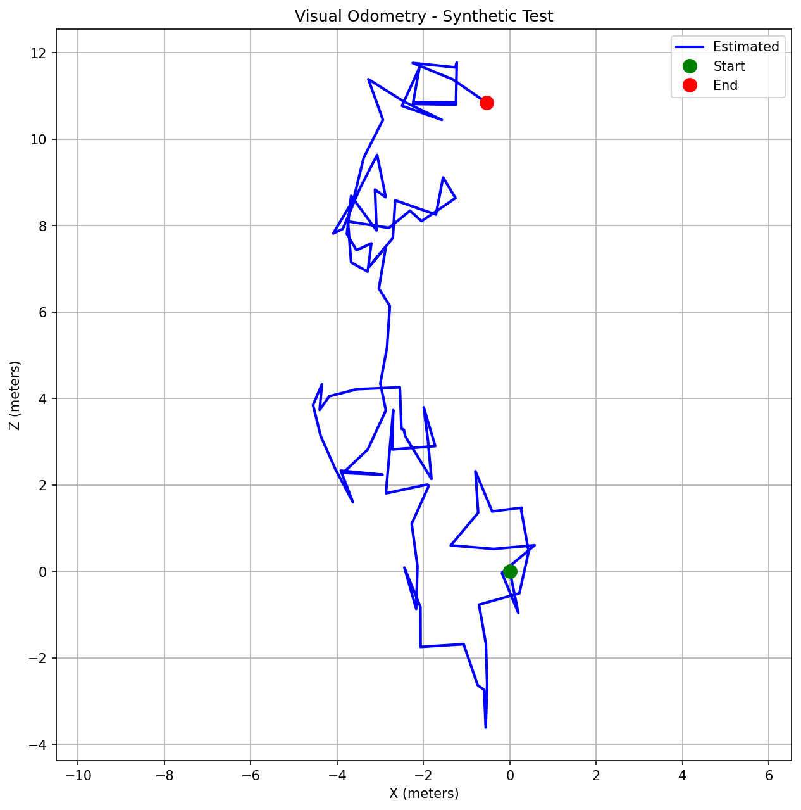

# Monocular Visual Odometry

[](https://python.org/)
[](https://opencv.org/)
[](LICENSE)

Monocular visual odometry pipeline that estimates camera ego-motion from a single image sequence using ORB feature matching and Essential Matrix decomposition.

---

## Results

Trajectory estimated on KITTI Sequence 00 (500 frames):



---

## How It Works

The pipeline runs frame-to-frame using a keyframe-based approach:

```
Frame → ORB Detection → Lowe's Ratio Matching → Essential Matrix (RANSAC)
     → Pose Recovery (R, t) → Trajectory Accumulation → Keyframe Update
```

1. **ORB feature extraction** — detects up to 2000 keypoints per frame
2. **Brute-force matching** — filtered with Lowe's ratio test (threshold: 0.75)
3. **Essential Matrix estimation** — RANSAC with 1px inlier threshold
4. **Pose recovery** — `cv2.recoverPose` gives rotation R and translation t
5. **Keyframe update** — triggered when matches drop below 50 or translation exceeds 0.1m

---

## Project Structure

```
├── src/
│   ├── visual_odometry.py    # Main VO pipeline + keyframe management
│   ├── feature_extractor.py  # ORB detector wrapper
│   ├── feature_matcher.py    # BFMatcher with Lowe's ratio test
│   ├── motion_estimator.py   # Essential Matrix + recoverPose
│   └── visualization.py      # Trajectory plotting
├── assets/                   # Output trajectory images
├── main.py                   # KITTI dataset runner
├── test_simple.py            # Unit tests
└── requirements.txt
```

---

## Quick Start

### Install dependencies

```bash
git clone https://github.com/redddddyyyyy/visual-odometry.git
cd visual-odometry
pip install -r requirements.txt
```

### Run on KITTI

Download [KITTI Odometry dataset](https://www.cvlibs.net/datasets/kitti/eval_odometry.php) and place sequence `00` at `data/kitti/00/`:

```
data/kitti/00/
├── image_0/       # grayscale frames
└── calib.txt      # camera calibration
```

```bash
python main.py
```

This processes 500 frames, prints position every 50 frames, and saves the trajectory plot to `assets/trajectory.png`.

---

## Dependencies

| Package | Version |
|---------|---------|
| numpy | ≥ 1.21 |
| opencv-python | ≥ 4.5 |
| matplotlib | ≥ 3.5 |

---

## Limitations

- **Scale ambiguity** — monocular VO cannot recover absolute scale; translation direction is correct but magnitude is up to scale
- **No loop closure** — drift accumulates over long sequences
- **Grayscale only** — color channels not used

---

## License

MIT
